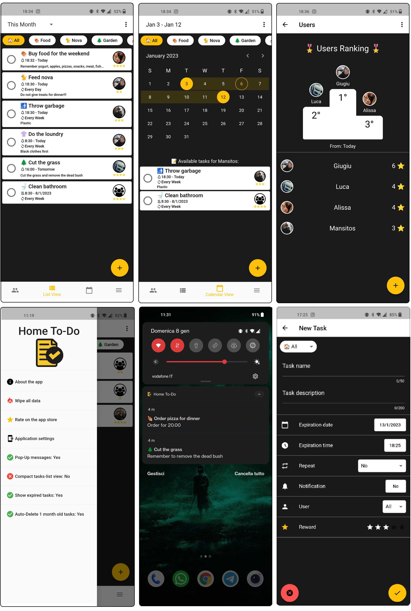

# Home To-Do
## A Mobile Prototype Application

This application was developed for the university exam "Sviluppo di Applicazioni Mobili/Mobile Apps Development".

This is my first mobile application ever built. My first project in Dart+Flutter SDK.

Università degli Studi di Udine - Italy

---

## Short app description
Home To-Do is an android "Task-Management" app developed in flutter sdk. The App lets you schedule your tasks, setup push notifications and organize them into categories. You can also create multiple users and assign tasks to them! Each task also has a score that will be assigned to the user who completes the activity. This kind of "game inside the app" (gamification) attempts to make using the app and completing household tasks fun and more stimulating.

---

## What you can find in the repository
- APK of the last build (inside release folder)
- Source-code (android-studio project)
- Lots of bugs and messy code 🙂 a strong refactoring phase is needed; some features are rushed
- A PDF Report "Relazione Progetto" (description of the design phase) in Italian language (for the exam)

If you want to use the code, please contact me first.

---

## Future development ?!?
This is my first mobile application development project! I really liked the Flutter SDK so I'm thinking about continuing to work on this app. I would like to build and publish my personal to-do app (as if there weren't enough on the market 😂) that fully reflects my tastes and my needs... who knows! If you are reading this and there is a new branch on this project, then I have decided to continue!

## Screenshots:

